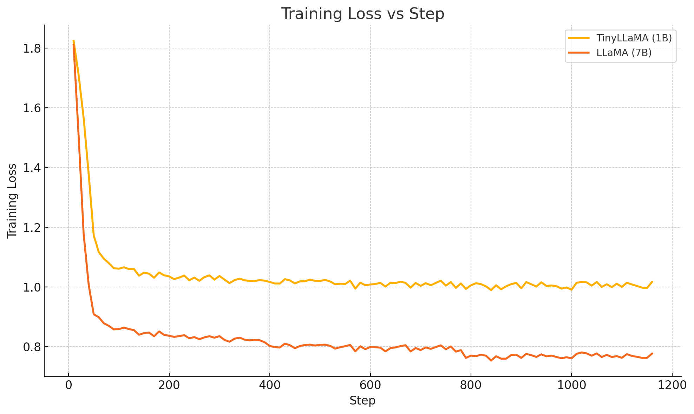
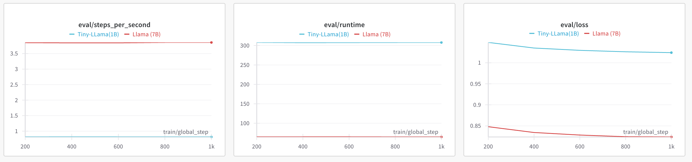
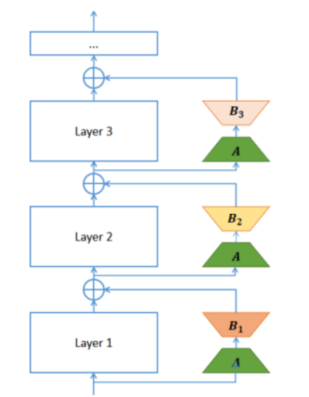

# Hybrid LoR2C + QLoRA

Research prototypes for parameter-efficient fine-tuning that combine **LoR2C**
(Low-Rank Residual Connection adapters that bypass whole decoder layers) with
**quantization** (QLoRA-style int8 training and quantization-aware training of
the adapters). Experiments target TinyLlama-1.1B and Llama-7B on Alpaca-style
instruction data, plus SmolVLM-500M on image captioning.

## Repository layout

| Path | Purpose |
|---|---|
| `prototype.py` | LoR2C fine-tuning of a Llama-family model on Alpaca data (`base` LoRA or `lor2c` mode) |
| `quantization_prototype.py` | Same pipeline with quantization-aware training (QAT) of the LoR2C adapters; saves a quantized adapter |
| `lora-vlm/lora-smolvlm.py` | Baseline LoRA fine-tuning of SmolVLM-500M-Instruct on image captions |
| `lora-vlm/lor2c-smolvlm.py` | LoR2C adapter fine-tuning of SmolVLM-500M-Instruct |
| `notebooks/` | Exploratory notebooks (LoR2C prototype, standard fine-tuning baseline) |
| `lora-alpaca-qat/` | Released QAT-trained TinyLlama-1.1B adapter |
| `archive.zip` | Vendored `peft-0.5.0` fork providing `MSLoraConfig` and `LlamaLoRALayer` |
| `assets/` | Result plots and previews used below |

## Setup

Python 3.10 is recommended.

```bash
pip install -r requirements.txt

# The Llama prototypes need the vendored peft fork (NOT upstream peft):
unzip archive.zip
pip install -e peft-0.5.0
```

The prototypes read prompt templates from a local `templates/` directory
(Alpaca format, e.g. `templates/alpaca.json` from
[alpaca-lora](https://github.com/tloen/alpaca-lora/tree/main/templates)).

## Usage

Train LoR2C on TinyLlama with Alpaca-cleaned (defaults shown):

```bash
python3 prototype.py \
  --base_model TinyLlama/TinyLlama-1.1B-Chat-v0.6 \
  --data_path yahma/alpaca-cleaned \
  --mode lor2c \
  --output_dir ./lora-alpaca
```

`--mode base` runs plain LoRA for comparison. LoR2C rank/alpha are chosen
automatically from the model's hidden size (r=4/α=8 for ≤2048, r=16/α=32 above).

Quantization-aware training (saves the quantized adapter to `<output_dir>-qat`):

```bash
python3 quantization_prototype.py --mode lor2c
```

SmolVLM captioning experiments (log to Weights & Biases):

```bash
python3 lora-vlm/lora-smolvlm.py    # LoRA baseline
python3 lora-vlm/lor2c-smolvlm.py   # LoR2C
```

## Results

### Metrics: Llama-7B vs TinyLlama-1.1B





### LoR2C model preview



## Development

See [CONTRIBUTING.md](CONTRIBUTING.md) for the project's engineering standards
(linting, commit conventions, and repository hygiene). Lint locally with:

```bash
ruff check .
```
