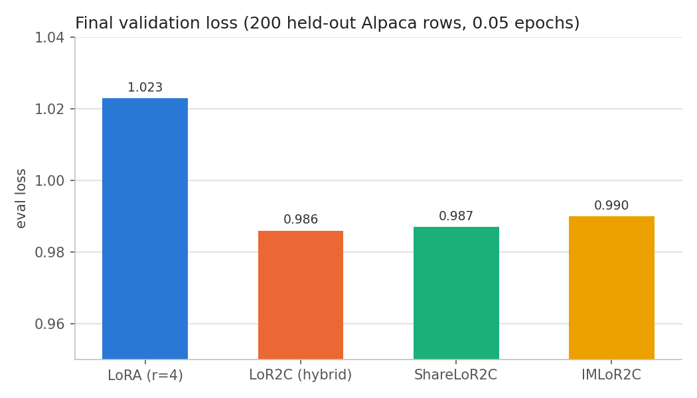
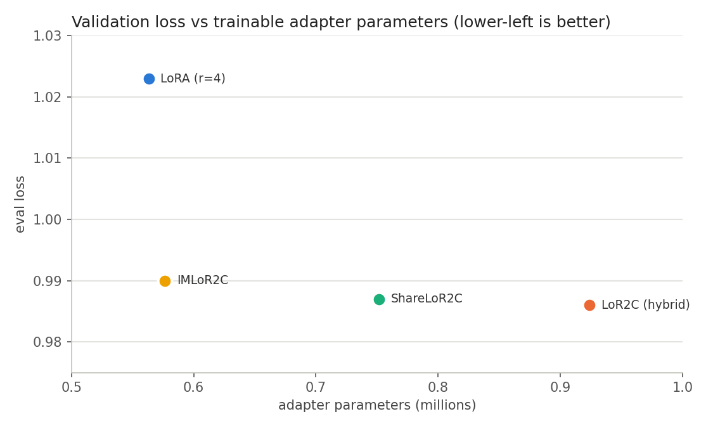
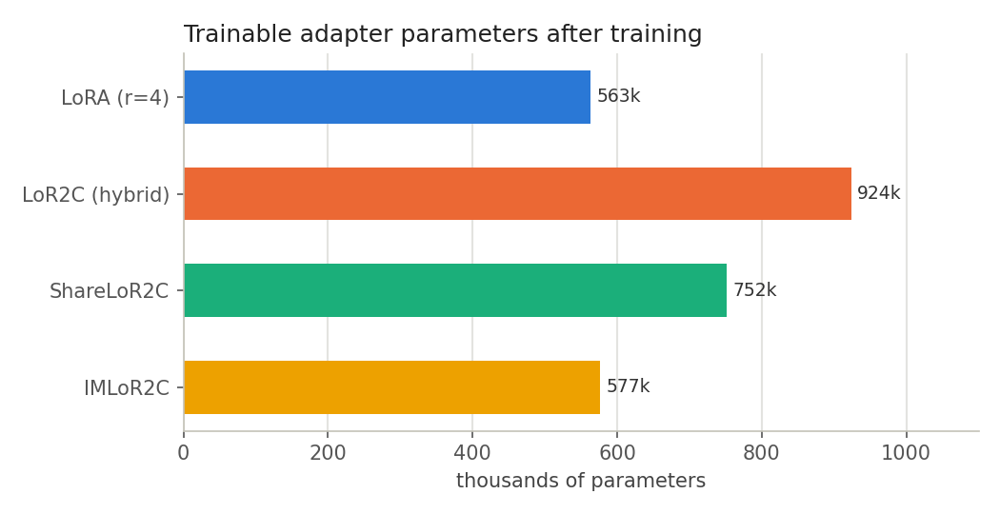
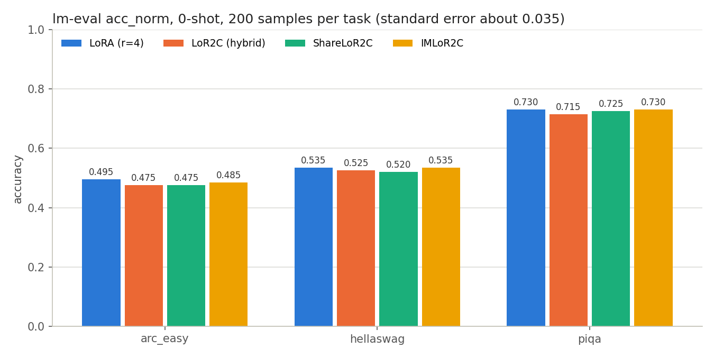
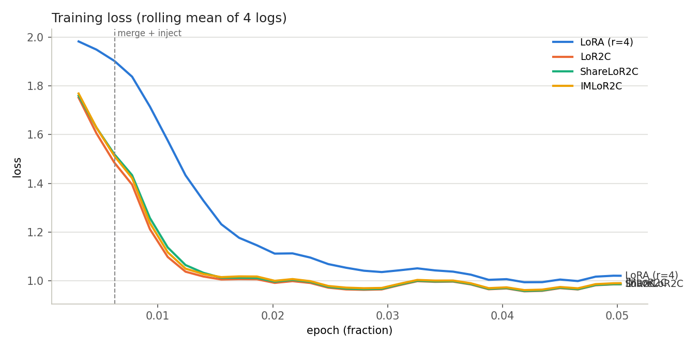
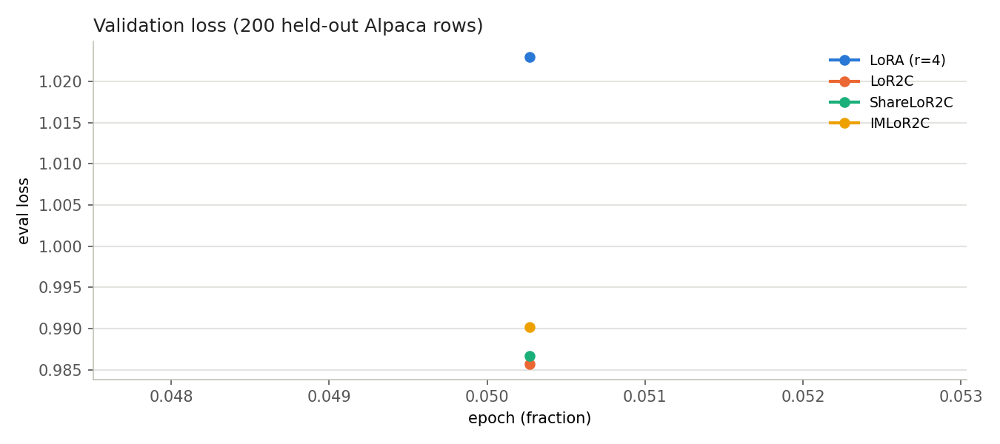
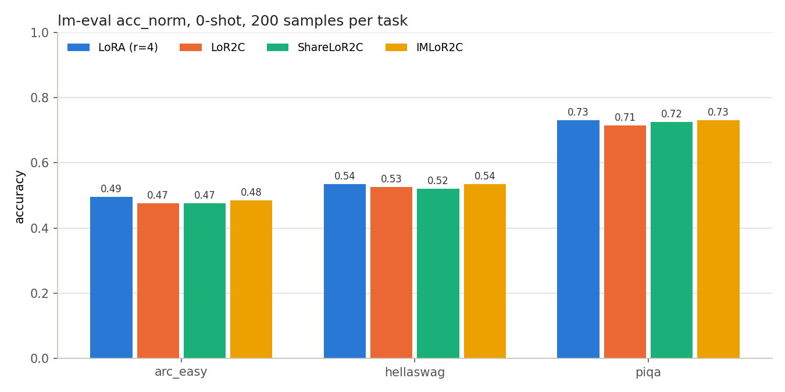
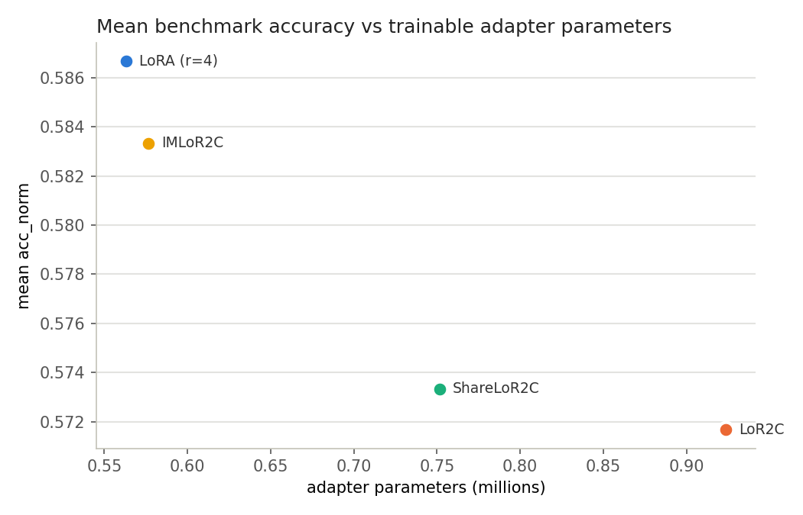

# Results: LoR2C variants vs LoRA on TinyLlama-1.1B

First controlled comparison produced by the `lor2c` package, run on a Google Colab T4
(transformers 5.x, fp32 weights) on 2026-08-25. Every number below comes from
the configs in [results/configs/](results/configs/) generated by the notebook recipe in
[REPRODUCE.md](REPRODUCE.md). Raw artefacts are checked in under [results/](results/):
training and evaluation logs, `scores.json`, the final residual `manifest.json` of each run,
and `summary.csv`.

## Setup

| | |
|---|---|
| Base model | `TinyLlama/TinyLlama-1.1B-Chat-v0.6`, fp32, frozen |
| Data | `yahma/alpaca-cleaned`, cutoff 128 tokens, 200 held-out rows |
| Budget | 0.05 epochs = 162 optimisation steps, batch 16 (micro 4), lr 3e-4, 10 warmup steps |
| Adapter rank | r = 4, alpha = 8 for every variant |
| Seed | 42 (single seed) |
| Evaluation | `lm-eval` 0-shot `acc_norm` on `arc_easy`, `hellaswag`, `piqa`, 200 samples each |

Four variants, identical budget:

| Variant | Config | What is trained |
|---|---|---|
| LoRA (r=4) | `adapter.mode: base` | LoRA on `q_proj`/`v_proj` of all 22 layers |
| LoR2C (hybrid) | `adapter.mode: lor2c` | attention LoRA **plus** one residual adapter per decoder layer |
| ShareLoR2C | `adapter.mode: lor2c`, `shared: true` | as LoR2C, with one shared down projection `A` |
| IMLoR2C | `adapter.mode: lor2c`, `adaptation: {merges: 2, injections: 2}` | as LoR2C, with two merges and two injections during the first quarter of training; attention LoRA at r = 2 |

The IMLoR2C schedule fired as designed: at step 20 it merged `floor7+floor8` (kept `floor7`)
and injected layer 10; at step 40 it merged `floor12+floor13` (kept `floor13`) and injected
layer 9. All decisions used the paper's SFS score (`1 - top_k/total`, k = r/2 = 2).

## Headline table

| Variant | adapter params | final eval loss | arc_easy | hellaswag | piqa | mean acc |
|---|---:|---:|---:|---:|---:|---:|
| LoRA (r=4) | 563,200 | 1.023 | 0.495 | 0.535 | 0.730 | 0.587 |
| LoR2C (hybrid) | 923,648 | **0.986** | 0.475 | 0.525 | 0.715 | 0.572 |
| ShareLoR2C | 751,616 | 0.987 | 0.475 | 0.520 | 0.725 | 0.573 |
| IMLoR2C | 576,512 | 0.990 | 0.485 | 0.535 | 0.730 | 0.583 |

## Findings

### 1. LoR2C converges about three times faster (win)

| Variant | loss at step 5 | loss at step 10 | first step with loss <= 1.05 | mean of last 3 logs |
|---|---:|---:|---:|---:|
| LoRA (r=4) | 1.983 | 1.916 | 75 | 1.020 |
| LoR2C (hybrid) | 1.752 | 1.459 | **25** | 0.985 |
| ShareLoR2C | 1.760 | 1.498 | 30 | 0.985 |
| IMLoR2C | 1.769 | 1.489 | **25** | 0.989 |

Every LoR2C variant crosses loss 1.05 by step 25 to 30; LoRA needs 75 steps, and the gap is
already 0.23 nats at the first logged step. This is the paper's mechanism showing up: the
residual path `h_{t+1} = h_t BA + Layer(h_t)` gives each layer a direct linear gradient route,
so adapters receive a useful signal immediately rather than after it has propagated through
the attention block. The dashed line marks the first IMLoR2C merge/inject event; the curve
does not flinch when adapters are merged or removed.

### 2. Lower validation loss at an equal parameter budget (win, the strongest result)

All LoR2C variants end 3.5% lower in held-out loss than LoRA. The comparison that matters is
**IMLoR2C vs LoRA: 577k vs 563k parameters, i.e. the same budget**, and IMLoR2C still wins on
both convergence speed and validation loss. The hybrid LoR2C's advantage could be attributed
to its 64% larger parameter count; IMLoR2C's cannot.

### 3. Merge and inject deliver the paper's parameter reduction (win)

IMLoR2C finished 38% smaller than plain LoR2C (924k to 577k) with the same loss curve:
two merges removed two residual adapters, and two injections replaced two more with
half-rank attention LoRA. This is the first end-to-end confirmation that the merge/inject
machinery in this package does what the paper describes.

### 4. Downstream benchmarks are a draw (expected at this budget)

All four variants sit within 1 to 2 points of each other. With 200 samples per task the
standard error is about 3.5 points, so nothing here separates them, and 162 steps of Alpaca
cannot move 0-shot commonsense benchmarks, which mostly measure the frozen base model. Read
this chart as "nothing is broken", not as a ranking.

### 5. The paper's parameter-halving claim is not yet tested (open)

The paper compares LoR2C **alone** against LoRA. The `lor2c` mode used here is the hybrid
(residual adapters plus attention LoRA), which is why it carries 924k parameters rather than
the roughly 280k a residual-only r = 4 configuration would. `adapter.mode: residual` now exists
for exactly this comparison; the next run should add it to the matrix.

## Caveats

- `train.evaluation: 40` produced a single end-of-run evaluation in these logs, so the
  validation-loss figure has one point per variant rather than a trajectory; the numbers are
  correct but intermediate evaluations are missing.
- Single seed, 162 steps. The convergence and validation-loss gaps are large relative to
  step-to-step noise, but reportable numbers need `train.epochs: 1` or more, `benchmark.limit:
  null`, and at least three seeds.
- fp32 weights on a T4; the paper used fp16 on LLaMA-2-7B. Absolute numbers are not comparable
  with the paper's tables, only the relative ordering is.
- The residual-only and LLaMA-2-7B (`configs/llama2_7b_im.yaml`) runs remain to be done.

## Next experiments

1. Add `residual` to the matrix at r = 4 and compare against LoRA at equal parameters.
2. Rerun the matrix at 1 epoch, full benchmark sets, three seeds; report mean and standard error.
3. LLaMA-2-7B with `configs/llama2_7b_im.yaml` on an A100 to compare with the paper's Table II.

## Appendix: figures as produced in the notebook

The charts above were regenerated from `summary.csv` for the repository; these are the
unmodified figures saved by the Colab notebook (`logs/*.png` in the results archive).

